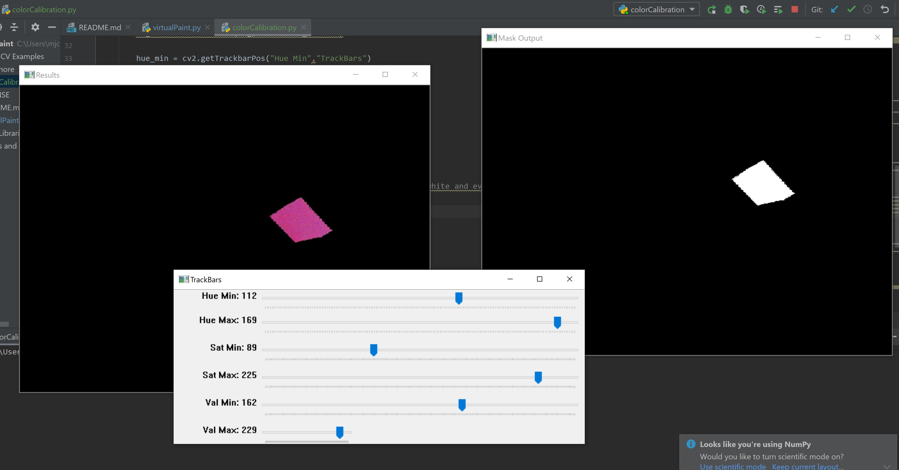
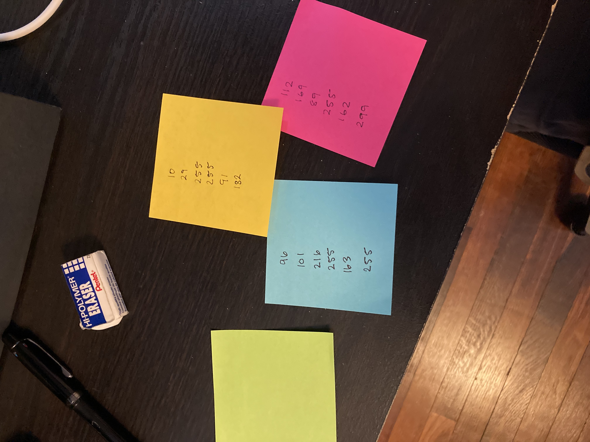
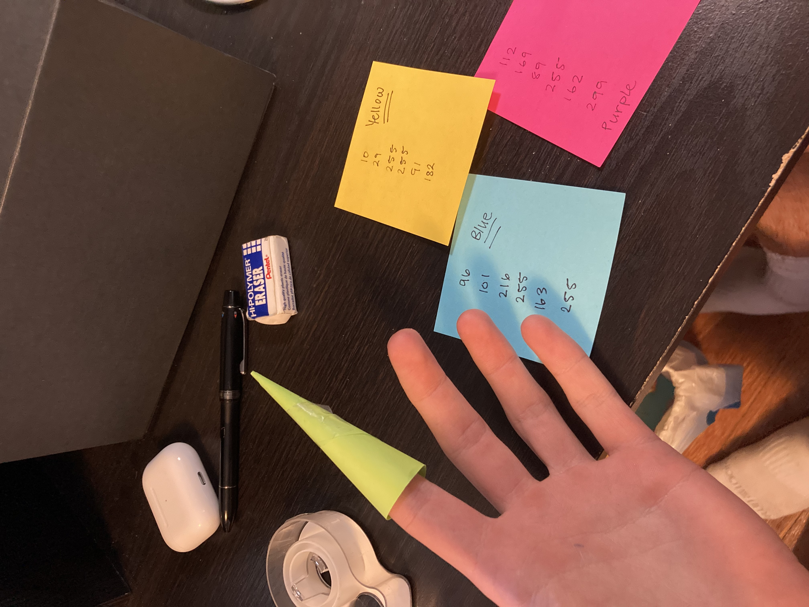

# VirtualPaint

## Table of Contents
+ [About](#about)
+ [Getting Started](#getting_started)
+ [Usage](#usage)
+ [Contributing](../CONTRIBUTING.md)
+ [Acknowledgements](#acknowledgements)

## About 
A simple python application is written in OpenCV that lets you paint a picture with a paintbrush, your fingers, or a folded post-it note.

## Getting Started 
These instructions will get you a copy of the project up and running on your local machine for development and testing purposes. See [deployment](#deployment) for notes on how to deploy the project on a live system.

### Prerequisites

* Python v.3.8
* numpy
* cv2

### Installing

1. Fork or download this repository
2. Calibrate your colors, see instructions in colorCalibration.py
3. Run virtualPaint
> python virtualPaint.py

## Usage 

### Calibration

### Update values and have fun drawing!

## 🎉 Acknowledgements 
[Murtaza's Workshop - OpenCV](https://www.youtube.com/watch?v=WQeoO7MI0Bs&list=WL&index=28)

